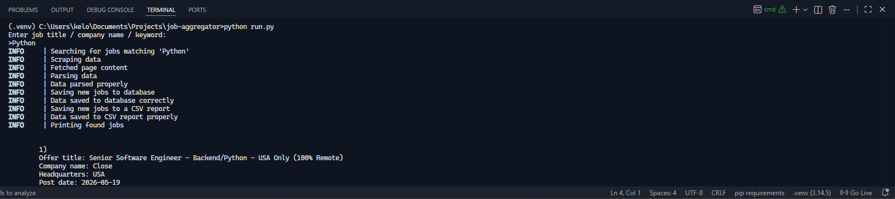
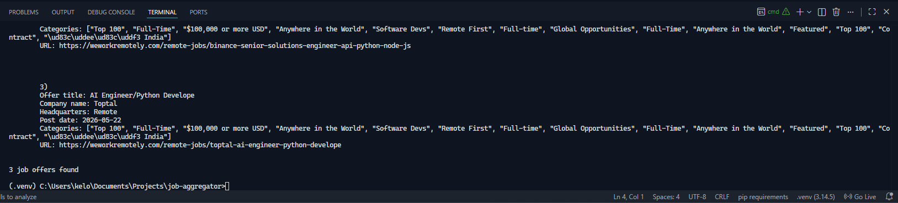

# JOB AGGREGATOR

Job Aggregator uses weworkremotely.com website to scrape job offers using keyword provided by the user.
Script scrapes data, parses it, appends data to database, appends data to todays snapshot as CSV file and leaves a logfile.
!! Use script responsibly and introduce delays between requests to not cause disruptions

## HOW IT WORKS

1. User enters keyword
2. Script konfigures the URL
3. Playwright opens the website and scrapes job offers data
4. Parses data into workable form
5. Using formatted data creates csv report at `reports\snapshot{today's_date}.csv`
6. Appends data to the database at `data\database.db`
7. Leaves a logfile at `logs\app.log`

## Showcase




## Installation

### 1. Clone the repository

- git clone https://github.com/Kelooo0/job-aggregator.git
- cd job-aggregator

### 2. Install virtual environment

- Windows: python -m venv .venv
- Linux/macOS: python3 -m venv .venv

### 3. Activate virtual environment

- Windows: .venv\Scripts\activate
- Linux/macOS: source .venv/bin/activate

### 4. Install dependencies

- Run in root folder: pip install -r requirements.txt && python -m playwright install chromium

### 6. How to run

- Windows: python run.py
- Linux/macOS: python3 run.py

## Project structure

```text
job-aggregator/
├── assets/                     # Project documentation folder
├── data/                       # Database file folder
├── job_aggregator/             # Main app package
│   ├── core/
│   │   ├── __init__.py
│   │   ├── config.py           # App configuration file
│   │   └── logger.py           # Logging setup
│   ├── ingestion/
│   │   ├── __init__.py
│   │   ├── parser.py           # Parses html and returns clean job offers
│   │   └── scraper.py          # Scrapes raw page html
│   ├── reporting/
│   │   ├── __init__.py
│   │   └── report.py           # Generates CSV reports
│   ├── services/
│   │   ├── __init__.py
│   │   └── service.py          # Coordination of functions
│   ├── storage/
│   │   ├── __init__.py
│   │   ├── database.py         # Saves new job offers to database
│   │   └── models.py           # Holds dataclasses
│   ├── __init__.py
│   └── main.py                 # Main logic operator
├── logs/                       # Holds app log file
├── reports/                    # Holds CSV reports
├── .gitignore
├── README.md
├── requirements.txt
└── run.py                      # Main app entry point
